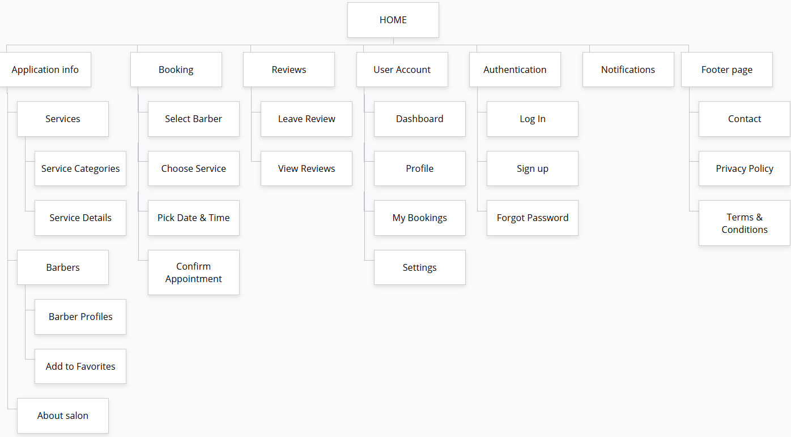

# User personas and information architecture

## Introduction

The task for this assignment is to create user personas and develop an information architecture for a specific project. User personas are fictional characters created to represent the different user types that might use a site, brand, or product in a similar way. Information architecture is the structural design of shared information environments, such as websites and software applications, to support usability and findability. Sitemaps are used to visualize the structure and hierarchy of information on a website.

We've created a set of 3 user personas relevant to our project. We've also developed an information architecture based on the card sorting method and created a sitemap for our web application. ChatGPT prompts are also included.

## Personas

### Prompt 
I am working on a web page that allows users to easily book appointments with barbers. The web page should display available barbers, their services, prices and working hours. Users should be able to select a preferred barber, choose a service (e.g., haircut, beard trim, styling), pick an available time slot, and confirm the appointment. The web page should also allow users to view and manage their upcoming bookings, as well as leave reviews for barbers.

Create a set of three user personas relevant to this project. These personas should represent the target audience for the web page. Include a variety of demographic details, personality traits, and context-specific information such as lifestyle, motivations for using the service, and technological comfort level.

### Personas

#### Persona 1: David Majić

<table>
    <tr>
        <td></td>
        <td>
            • Name: David Majić 
            • Age: 38 
            • Occupation: Teacher 
            • Location: Osijek, Croatia 
            • Household: Married with two children 
            • Income: Middle-to-Low income bracket 
            • Tech Comfort Level: Moderate 
            • Lifestyle: Busy professional, limited free time, prefers quick and reliable appointments. 
            • Motivation: Wants to schedule barber appointments efficiently without long waiting times. 
            • Preferences: Values consistent quality and familiarity with the barber.
        </td>
    </tr>
</table>

#### Persona 2: Ana Klarić

<table>
    <tr>
        <td></td>
        <td>
            • Name: Ana Klarić 
            • Age: 28 
            • Occupation: Marketing Specialist 
            • Location: Zagreb, Croatia 
            • Household: Single, lives alone 
            • Income: Middle income bracket 
            • Tech Comfort Level: High 
            • Lifestyle: Social, trend-conscious, frequently changes hairstyles. 
            • Motivation: Wants to explore different barbers and styles, easy booking via mobile. 
            • Preferences: Prefers barbers with good reviews and modern techniques.
        </td>
    </tr>
</table>

#### Persona 3: Luka Rogić

<table>
    <tr>
        <td></td>
        <td>
            • Name: Luka Rogić 
            • Age: 48 
            • Occupation: Software Developer 
            • Location: Split, Croatia 
            • Household: Lives with partner 
            • Income: Upper-middle income bracket 
            • Tech Comfort Level: Very high 
            • Lifestyle: Busy work schedule, prefers planning ahead. 
            • Motivation: Wants to book appointments quickly without calling, prefers recurring appointments. 
            • Preferences: Looks for barbers who are punctual and skilled, values online reviews and booking confirmations.
        </td>
    </tr>
</table>

## Information Architecture

### Prompt
Develop an information architecture for this project based on the card sorting method.

### Information Architecture

 **Home**
 
1. **Application Info**:

        Services: Displays all available services offered by the salon.

        Service Categories: Organized list of services grouped by type (e.g., Haircuts, Beard Trims, Styling).

        Service Details: Detailed information for each service, such as duration, price, and description.

        Barbers: Section showcasing all barbers working in the salon.

        Barber Profiles: Individual barber pages showing experience, specialties, services, and ratings.

        Add to Favorites: Option to mark barbers as favorites for quicker access in future bookings.

        About Salon: Information about the salon, including background, team details, and mission.

    
2. **Booking**

        Select Barber: Choose a preferred barber from the available list or from favorites.

        Choose Service: Pick a specific service type (e.g., haircut, beard trim, styling).
    
        Pick Date & Time: Select a preferred date and time using an interactive calendar that displays available slots.
    
        Confirm Appointment: Review all booking details and confirm the appointment.
    

3. **Reviews**

        Leave Review: Form for users to rate and leave feedback for completed services.

        View Reviews: Browse reviews from other users to help make informed decisions when choosing barbers or services.

4. **User Account**

        Dashboard: Central hub showing an overview of user activity and quick access to key features.

        Profile: Manage personal information, contact details, and preferences.

        My Bookings: View current, past, and upcoming appointments.

        Settings: Adjust user account preferences and notification options.

5. **Authentication**

        Log In: Page for registered users to sign in.

        Sign Up: Registration form for new users to create an account.

        Forgot Password: Option to recover or reset a forgotten password.

6. **Notifications**

        Notifications section displaying alerts for upcoming appointments, special offers, and barber messages.

7. **Footer Page**

        Contact: Contact form and salon contact information.

        Privacy Policy: Details about data protection and how user information is handled.

        Terms & Conditions: Information on the website’s terms of use and user responsibilities.

  

## Sitemap

## LLM prompts
Prompt 1 – User Personas
Generate a set of three realistic user personas for a barber booking web application that allows customers to easily browse available barbers, view services, prices, and working hours, and book appointments online. The personas should represent different types of users with varying lifestyles, motivations, and comfort levels with technology. Each persona should include demographic information, behavioral traits, goals, and frustrations related to scheduling barber appointments online.

Prompt 2 – Information Architecture and Sitemap
Using the card sorting method, create a clear and logical information architecture and sitemap for a barber booking platform. The structure should reflect how users naturally explore and organize information when booking appointments, selecting services, viewing barbers, and managing upcoming bookings. The output should describe the main sections and subpages of the website, as well as their relationships and hierarchy.
